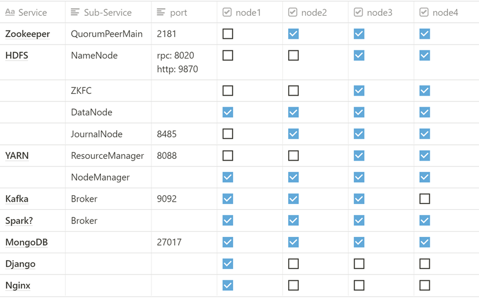

# 电影推荐系统

这个项目是一个基于开源大数据平台和相关框架的分布式电影推荐系统，并提供了Web前端为用户提供了方便友好的访问方式。

现有功能：

- 用户注册和登录
- 评分Top10电影和电影个性化推荐
- 电影概览、搜索、评分
- 推荐点击量统计

## 安装使用

1. 克隆该仓库
2. 下载以下软件包并放到tools目录中（注意版本）
   - apache-zookeeper-3.6.2-bin.tar.gz：https://zookeeper.apache.org/releases.html
   - jdk-8u271-linux-x64.tar.gz：https://www.oracle.com/java/technologies/javase/javase-jdk8-downloads.html
   - hadoop-3.2.1.tar.gz：https://hadoop.apache.org/releases.html
   - scala-2.11.12.tgz：https://www.scala-lang.org/download/2.11.12.html
   - spark-2.4.7-bin-hadoop2.7.tgz：https://spark.apache.org/downloads.html
   - kafka_2.11-2.4.1.tgz：http://kafka.apache.org/downloads
3. 下载以下数据集并放到datasets目录中（可能需要新建这个目录）
   - ml-25m.zip：https://grouplens.org/datasets/movielens/
4. 运行`bash build_up.sh`
5. 浏览器访问`http://<hostname>:31100`，其中`<hostname>`是部署主机的域名或ip
6. 使用完了可以运行`bash down.sh clean`来删除节点和镜像

## 采用框架

## 系统架构

## 节点分配

